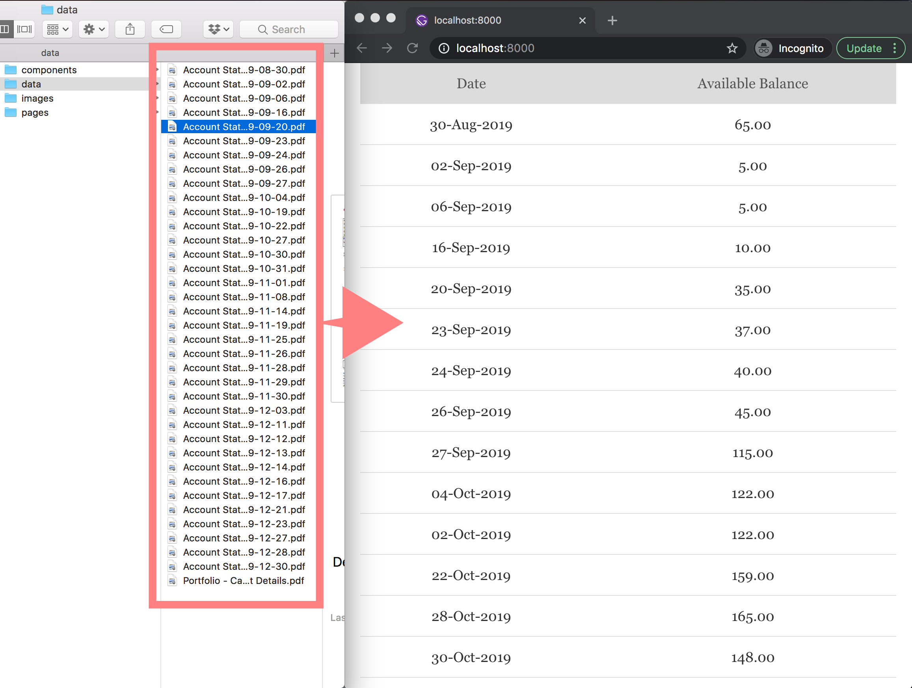

<h1 align="center">PDF to table</h1>

Convert mass PDF to table view. Base on [Gatsby](https://gatsbyjs.org) and relate plugins. This example is base on the OCBC bank statement format.
<p align="center">
  
</p>

## 🚀 Quick start

1.  **Start developing**
    ```shell
    cd gatsby-pdf-to-table
    gatsby develop
    ```

2.  **Open the source code and start editing**

    Your site is now running at `http://localhost:8000`!

    _Note: You'll also see a second link: _`http://localhost:8000/___graphql`_. This is a tool you can use to experiment with querying your data. Learn more about using this tool in the [Gatsby tutorial](https://www.gatsbyjs.org/tutorial/part-five/#introducing-graphiql)._

    Open `src/pages/index.js`. Save your changes and the browser will update in real-time!

3.  **Prepare your PDF source files**

    Store to `src/data/{your-pdf.pdf}`

4.  **Custom your search condition**
    ```js
    // src/pages/index.js
    // Custom 'Available Balance' and 'Credits' to your pattern
    const targetStr = Strings(JSON.stringify(node)).between('Available Balance', 'Credits').s

    ```

## 💫 Deploy
1.  **Create production build**
    ```shell
    # Build for production with minification to
    # Out put dir: public/
    gatsby  build

    # Serve the production build locally
    gatsby serve
    ```
